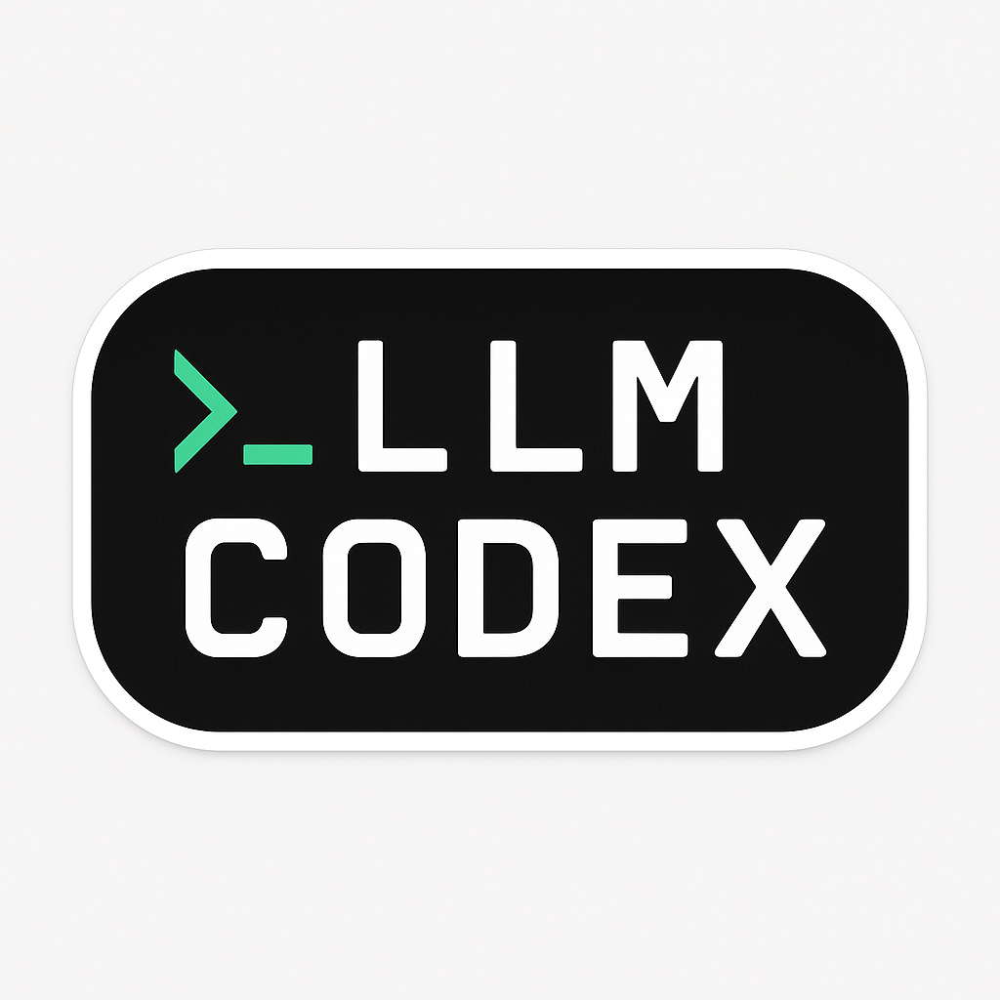

# 🧠 llm-codex

**`llm-codex`** is a smart CLI for generating, editing and running source code from natural language using your local LLM Studio model (LLaMA 3, Qwen, DeepSeek...).

---

## 🚀 What does it do?

✅ Generates code from natural language prompts  
✅ Edits existing files with AI  
✅ Automatically creates backups and logs  
✅ Executes `.py` and `.sh` scripts  
✅ Can be used from any folder (project-agnostic)  
✅ 100% console-based, no browser needed

---

## ⚙️ Installation

1. Clone the repository:

```bash
git clone https://github.com/your_user/llm-codex.git
cd llm-codex
```

2. (Optional) Create and activate a virtual environment:

```bash
python3 -m venv venv
source venv/bin/activate
```

3. Install in editable mode:

```bash
pip install -e .
```

---

## 💡 Requirements

- Python 3.7+
- `requests` library
- A local model running at:  
  `http://127.0.0.1:1234/v1/completions`

(LLM Studio must be active and listening on that port.)

---

## 🛠️ Available commands

### 1. 🆕 Generate code

```bash
llm-codex "create a Python function that calculates factorial"
```

📝 Creates a file like:  
`create_a_python_function.py`

---

### 2. 💾 Save to specific file

```bash
llm-codex "create a script to connect to PostgreSQL" connect.py
```

---

### 3. ✏️ Edit existing file

```bash
llm-codex --edit script.py "add logging and error handling"
```

📌 Backup created:  
`script.py.bak_20250510_141530`

---

### 4. 📄 Show prompt history

```bash
llm-codex --log
```

🧠 Displays `.llm_codex_logs/codex_log.txt`

---

### 5. 📁 List project files

```bash
llm-codex --list
```

---

## ✅ Full Example

```bash
llm-codex "create function to check if a number is prime"
# → saves create_function_to.py
# → asks if you want to execute it

llm-codex --edit create_function_to.py "optimize the algorithm"
llm-codex --log
```

---

## 📦 Project structure

```
.
├── create_function_to.py
├── another_script.py
└── .llm_codex_logs/
    └── codex_log.txt
```

---

## 🛡️ Safety

Code is not executed unless you confirm.  
All edited files are backed up first.

---

## 🧪 Future ideas

- `--run` to execute without confirmation  
- `--no-log` to skip logging  
- `--clear-log` to reset history  
- `--chat file.py` for interactive mode

---

## 🧑‍💻 Author

Developed by Ayose Medina  
2025 · IT Director · Python + LLM + Business Intelligence